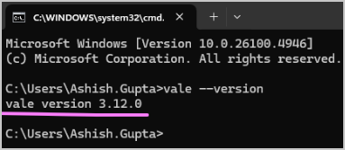
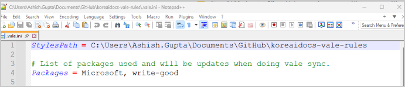
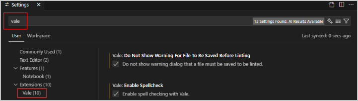
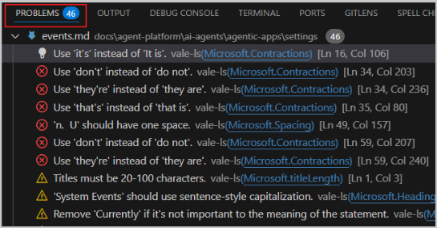
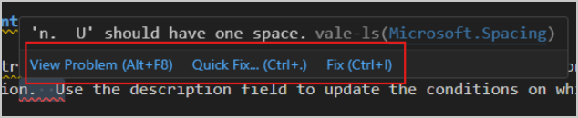
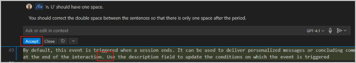

# How to enable Vale linting in VSCode

You must complete the following prerequisites before you begin to install Vale:

* [Trust your workspace](https://code.visualstudio.com/docs/editing/workspaces/workspace-trust#_trusting-a-workspace) in VSCode. This helps extensions work as desired in your workspace.  
* [Show file extensions in Windows Explorer](https://support.microsoft.com/en-us/windows/common-file-name-extensions-in-windows-da4a4430-8e76-89c5-59f7-1cdbbc75cb01). This helps avoid confusion when copy-pasting file name or when dragging a file on a command window to get its path.  
* [Update VSCode](https://code.visualstudio.com/docs/supporting/FAQ#_vs-code-versions) to the latest version.

To configure the Vale linter in VSCode, follow these steps:

1. On the command prompt, execute the command `winget install --id=errata-ai.Vale -e`.

2. To make sure that Vale is successfully installed, execute the command `vale --version`. It must display a version number.  
   

3. Clone the GitHub repository [https://github.com/ashishguptaiitb/koreaidocs-vale-rules](https://github.com/ashishguptaiitb/koreaidocs-vale-rules) locally. Let's assume that your local path is `C:\Users\X\Documents\GitHub\koreaidocs-vale-rules`.

4. Open the `.vale.ini` file in the above directory and change the value of the `StylesPath` variable to the path of the current folder. In our example, the value of the `StylesPath` variable becomes `C:\Users\X\Documents\GitHub\koreaidocs-vale-rules`. Save and close the `.vale.ini` file.
   

5. Open VSCode that's updated to the latest version. Select **File** > **Preferences** > **Settings**.

6. Search for **Vale** in the search settings field. In the search results, select **Vale** from the left sidebar.
   

7. Select the **Vale: Do Not Show Warning For File To Be Saved Before Linting** option.

8. Select the **Vale: Enable Spellcheck** option.

9. Change the value of the **Vale: Max Number Of Problems** option to 500.

10. In the **Vale > Vale CLI: Config** field, enter the path of the .ini settings file. In our example, the file path is `C:\Users\X\Documents\GitHub\koreaidocs-vale-rules\.vale.ini`.

11. Relaunch VSCode to load the settings.

12. Open an MD file and select **View** > **Problems** to view the style issues. Report generation may take some time. Update the content to resolve these issues.
   

13. Select each issue and update the content to resolve it. Hover the pointer over the issue to view the option to fix the problem.
   

14. Optionally, if you choose **Quick Fix**, it provides an AI-generated explanation of the problem, fixes the problem, and then prompts you to accept the updates. Choose **Accept** if you approve of the fix.
   
